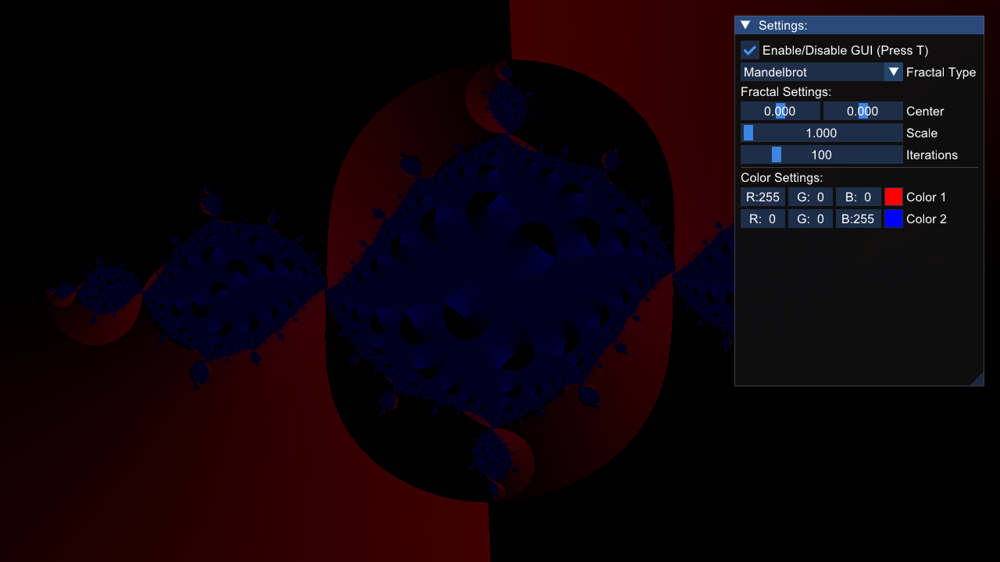
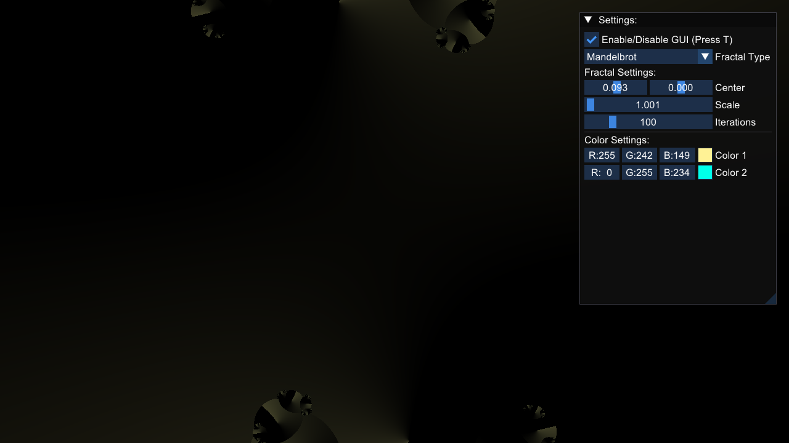
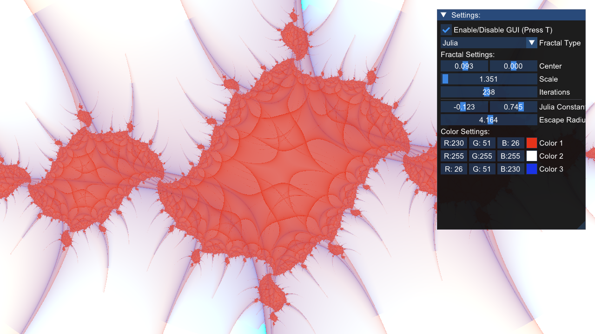
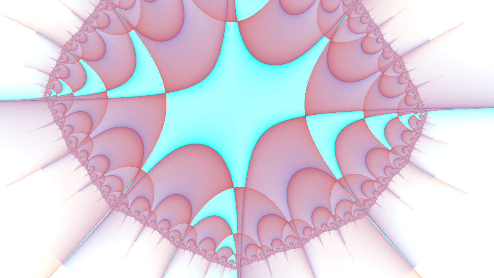
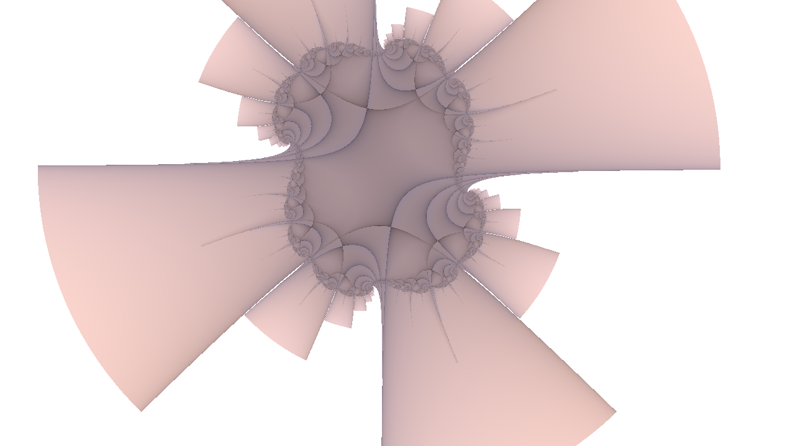
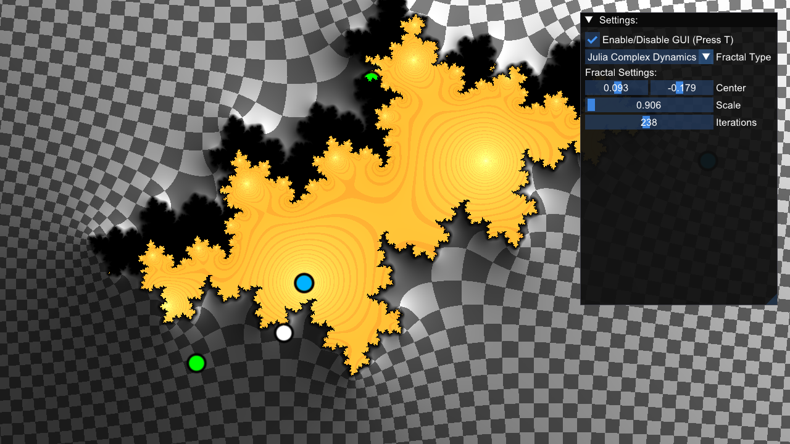
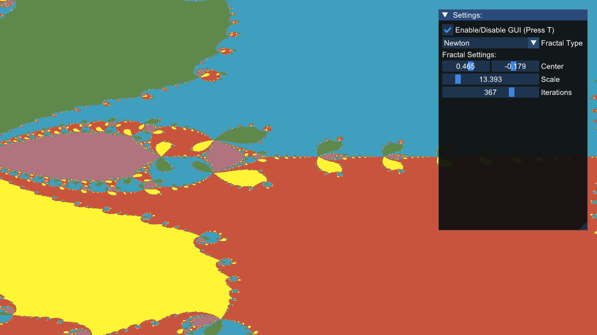

# Nebula Fractal Renderer

**Nebula** is a fractal renderer built using GLAD, GLFW, GLM, and ImGui. It generates stunning visualizations of fractals using modern OpenGL.

## Screenshots

### Mandelbrot Set




### Julia Fractal





### Julia Complex Dynamics



### Newton's Fractal



## Features

- Real-time rendering of fractals.
- Interactive user interface with Dear ImGui.
- GLAD for OpenGL loading.
- GLFW for window management.
- GLM for mathematical operations.
- CMake for cross-platform builds.

### Updated to use GraphicsInterface Library which includes all of the above.

## Dependencies

- [GLAD](https://github.com/Dav1dde/glad)
- [GLFW](https://github.com/glfw/glfw)
- [GLM](https://github.com/g-truc/glm)
- [ImGui](https://github.com/ocornut/imgui)

## Build Instructions

```bash
cmake -S . -B build
cmake --build build
cd build
./Nebula
```
